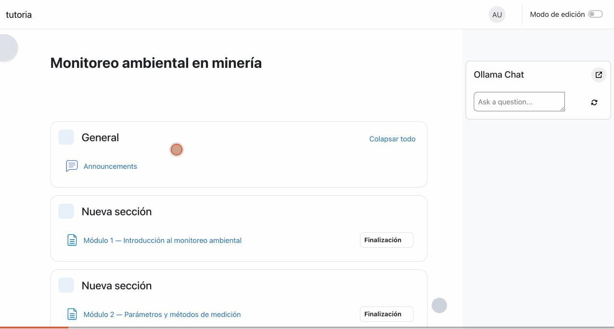

# Moodle + IA: Tutor inteligente con modelo local (Ollama)

Integración del **subsistema de IA de Moodle 5.0** con un **modelo de lenguaje local
(Ollama / llama3)** para que un curso de e-learning tenga un **asistente de IA** que
**resume y explica** el material — corriendo 100% en local, gratis y sin enviar datos a
terceros.

> Proyecto demostrativo: IA *funcionando dentro de* Moodle, no las dos cosas por separado.

  

## 🎬 Demo

El alumno entra a un módulo del curso, pulsa **✨ AI features → Explicar / Resumir**, y el
asistente lee el contenido de la página y devuelve una explicación/resumen en español,
generada por `llama3` corriendo en la misma máquina. El bloque **Tutor IA** además responde
preguntas libres sobre el curso.



*(Recorrido: página principal → módulo → el Tutor IA respondiendo en español.)*

## ✅ Qué hace (mapeado a un caso real)

| Capacidad | Estado |
|---|---|
| Instalar y configurar el subsistema de IA de Moodle | ✅ |
| Conectar un proveedor de IA (Ollama local) | ✅ |
| Asignar modelos por acción (generar / resumir / explicar) | ✅ |
| Asistente de curso que resume y explica contenido | ✅ |
| Respuestas en español | ✅ |
| Interfaz de Moodle y del bloque Tutor IA en español | ✅ |
| Provisioning del curso por código (API de Moodle) | ✅ |
| **Chatbot conversacional** que responde sobre el curso (RAG simple) | ✅ |
| **Feedback automático** según progreso (Python + API REST + IA) | ✅ |
| **Analítica:** informe docente + detección de alumnos en riesgo | ✅ |

## 🧱 Stack

| Capa | Herramienta |
|---|---|
| LMS | Moodle 5.0 (entorno oficial `moodlehq/moodle-docker`) |
| Subsistema IA | Providers / Placements / Manager (nativo de Moodle 5.0) |
| Proveedor | `aiprovider_ollama` (nativo) |
| Chatbot | `block_ollama_chat` (modo chat → `/v1/chat/completions` de Ollama) |
| Modelo (chat) | Ollama → `llama3` |
| Modelo (embeddings, para RAG futuro) | `nomic-embed-text` |
| Provisioning | PHP + APIs internas de Moodle |

## 📂 Estructura

```
moodle-tutor-ia/
├── curso/        Material del curso demo (Markdown) → se carga en Moodle
├── scripts/      Automatización con las APIs de Moodle
│   ├── 01_provision_curso.php       Crea el curso y los módulos
│   ├── 02_cargar_contenido.php      Carga el material (formato Markdown)
│   ├── 03_instrucciones_espanol.php Ajusta la IA para responder en español
│   ├── 04_config_chatbot.php        Configura el chatbot (rol + material como fuente)
│   ├── 05_feedback_analitica.py     Feedback + analítica (Python, API REST + IA local)
│   └── personalizaciones/           Customizaciones versionadas (idioma es del bloque Tutor IA)
├── docs/         Documentación técnica y de negocio
│   ├── como-reproducir.md           Levantar todo el entorno paso a paso
│   ├── decisiones-tecnicas.md       Problemas resueltos (clave para entrevista)
│   ├── idioma-y-acceso-demo.md      Interfaz en español + acceso remoto para revisión
│   └── recomendacion-escala-presupuesto.md   Local vs nube según el cliente
└── capturas/     Video e imágenes de la demo
```

## 🚀 Cómo reproducirlo

Ver **[docs/como-reproducir.md](docs/como-reproducir.md)** — levanta Moodle local con
Docker, carga el curso y conecta Ollama, paso a paso.

## 📌 Curso demo

**"Monitoreo ambiental en minería"** — material propio del dominio ESG (genérico y
neutral). Doble propósito: portfolio técnico y base para una línea de *capacitación
sectorial con IA*.

## 🛣️ Roadmap

El chatbot usa **RAG simple** (inyecta el material como contexto). Próximas mejoras:

1. **RAG real con embeddings:** indexar el material con `nomic-embed-text` y recuperar solo
   los fragmentos relevantes (escala mejor con cursos grandes que el contexto completo).
2. **Automatizar el informe:** correr `05_feedback_analitica.py` de forma programada (cron) y
   enviar el feedback a cada alumno y el informe al docente por mensajería de Moodle.
3. **Más señales:** sumar notas de quizzes y último acceso al modelo de riesgo de abandono.
